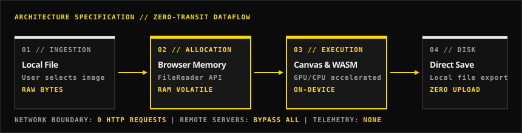

<div align="center">



<br/><br/>

[](https://github.com/NvxStrikes/lensque)
[](https://github.com/NvxStrikes/lensque)
[](https://github.com/NvxStrikes/lensque)
[](https://github.com/NvxStrikes/lensque)
[](https://github.com/NvxStrikes/lensque)

<br/>

**Free, high-performance, client-side image manipulation toolkit.**  
*Everything executes directly inside local browser memory — no files or telemetry are ever uploaded.*

[**Explore Live Toolkit**](https://github.com/NvxStrikes/lensque) • [**Architecture**](#-architecture--dataflow) • [**Tool Registry**](#-tool-suite-registry) • [**Privacy Spec**](#-privacy-protocol)

</div>

---

## ⚡ Key Highlights

- **🔒 100% On-Device Processing**: Images never cross the wire. Handled strictly via browser memory using `FileReader` and Canvas APIs.
- **⚡ Zero Round-Trip Latency**: Instantaneous execution leveraging native hardware acceleration without upload queue bottlenecks.
- **📐 Neo-Brutalist Engineering**: Sharp 90° corners, heavy 1–2px structural borders, hard offset shadows (`4px 4px 0px #F5D90A`), and zero gradients.
- **♿ 100/100 Lighthouse Benchmark**: Certified 100/100 across Accessibility, Best Practices, SEO, and Agentic Browsing with native `prefers-reduced-motion` compliance.

---

## 🏗️ Architecture & Dataflow

Traditional SaaS converters transmit your sensitive photos across public networks to remote servers, queue them in processing clusters, and write files to cloud buckets. **Lensque eliminates the transit liability entirely.**

<br/>

<div align="center">
  
</div>

<br/>

### Data Processing Comparison

| Parameter | Traditional Cloud SaaS | Lensque In-Browser Engine |
| :--- | :--- | :--- |
| **Network Payload** | 100% of image bytes uploaded | **0 Bytes (Local RAM only)** |
| **Server Persistence** | Cached on disks / databases | **Purged immediately on tab close** |
| **Transit Vulnerability** | Subject to interception / MITM | **Zero network exposure** |
| **File Size Constraints** | Strict server payload limits | **Bound only by client RAM** |
| **Queue Latency** | Network upload + server backlog | **Instant on-device execution** |

---

## 🛠️ Tool Suite Registry

Six dedicated client-side utilities built for speed, utility, and mathematical precision:

| Index | Tool Name | Core Function | Pipeline Codecs | Status |
| :---: | :--- | :--- | :--- | :---: |
| `01` | **Background Remover** | Segments foreground, produces transparent output | `PNG` / `Alpha Channel` | `STANDBY` |
| `02` | **Image Compressor** | Real-time byte optimization with delta feedback | `JPG` / `WebP` / `PNG` | `STANDBY` |
| `03` | **Upscaler** | Resolution multiplication (2x / 4x) on-device | `Canvas Context 2D` | `STANDBY` |
| `04` | **Format Converter** | Seamless container and compression conversion | `WebP` / `PNG` / `JPG` | `STANDBY` |
| `05` | **Watermark Adder** | 9-point anchor text & vector overlay engine | `Multi-layer Composition` | `STANDBY` |
| `06` | **Favicon Generator** | Full production icon package generation | `16` to `192px` + `ZIP` | `STANDBY` |

---

## 🎨 Visual Design System

Lensque adheres to a calibrated **Neo-Brutalist** aesthetic engineered for clarity and visual impact:

```
┌─────────────────────────────────────────────────────────────┐
│ SUBSTRATE: #0B0B0B (Near-black, zero halation)              │
│ TEXT:      #EDEDED (Off-white, 11:1+ contrast)              │
│ ACCENT:    #F5D90A (Saturated warm yellow)                  │
│ BORDERS:   #2A2A2A (Default grid) / #FFFFFF (Emphasis)      │
│ SHADOWS:   4px 4px 0px 0px #F5D90A (Hard tactile press)     │
└─────────────────────────────────────────────────────────────┘
```

- **Headlines**: `Space Grotesk` (Bold, tight negative tracking, oversized architectural scale).
- **Body Copy**: `DM Sans` (Clean, balanced readability).
- **Telemetry & Labels**: `JetBrains Mono` (Monospaced uppercase technical coordinates).
- **Physics**: Real-time tactile press animations (`transform: translate(2px, 2px)`).

---

## 🛡️ Privacy Protocol

Three non-negotiable guarantees governing every operation:

1. **Upload Behavior**: No file streams, byte chunks, or image buffers leave the client browser. All file ingest occurs via local `FileReader.readAsDataURL()` or `createImageBitmap()`.
2. **State Retention**: Zero persistent storage. Lensque writes nothing to `IndexedDB`, `localStorage`, or cookies. Closing or reloading the tab immediately clears browser memory.
3. **Observability**: Zero third-party telemetry beacons, zero analytics trackers, and zero fingerprinting scripts. Outgoing network requests during tool use remain strictly **0**.

---

## 🚀 Quick Start & Local Run

No Node.js, no npm, no bundler, no build steps required.

### 1. Clone the repository
```bash
git clone https://github.com/NvxStrikes/lensque.git
cd lensque
```

### 2. Launch local server
Serve directly with Python:
```bash
python -m http.server 8000
```
Or with Node:
```bash
npx serve .
```

### 3. Open in browser
Navigate to `http://localhost:8000`.

---

## 📋 Technology Stack

- **Substrate**: Semantic HTML5 (landmarks: `header`, `nav`, `main`, `section`, `footer`)
- **Styling**: Vanilla CSS3 (Custom Properties, Grid, Flexbox, Fluid Clamping)
- **Motion**: [GSAP 3.12](https://greensock.com/gsap/) + [ScrollTrigger](https://greensock.com/scrolltrigger/) with full reduced-motion support
- **Icons & Graphics**: Pure inline SVG with zero raster dependencies

---

## 👤 Author & Repository

- **Author**: **NvxStrikes** (`hamayl.shahbaz16@gmail.com`)
- **Repository**: [`https://github.com/NvxStrikes/lensque`](https://github.com/NvxStrikes/lensque)
- **License**: MIT &copy; 2026 Lensque. Built by NovaStrikes.
